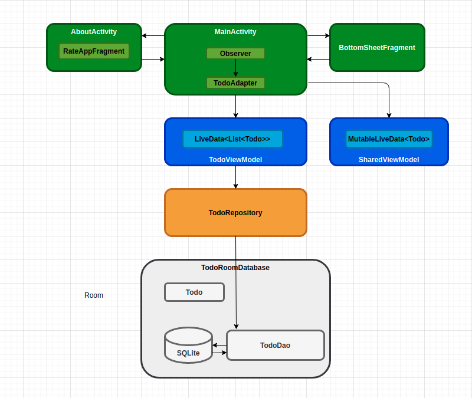
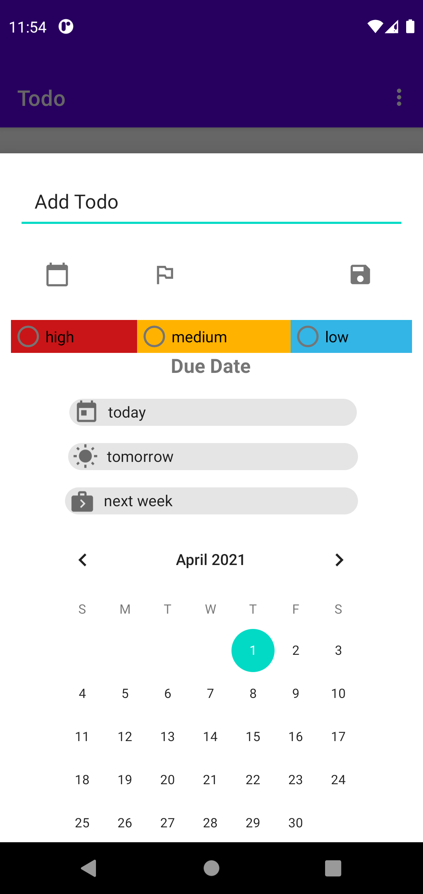
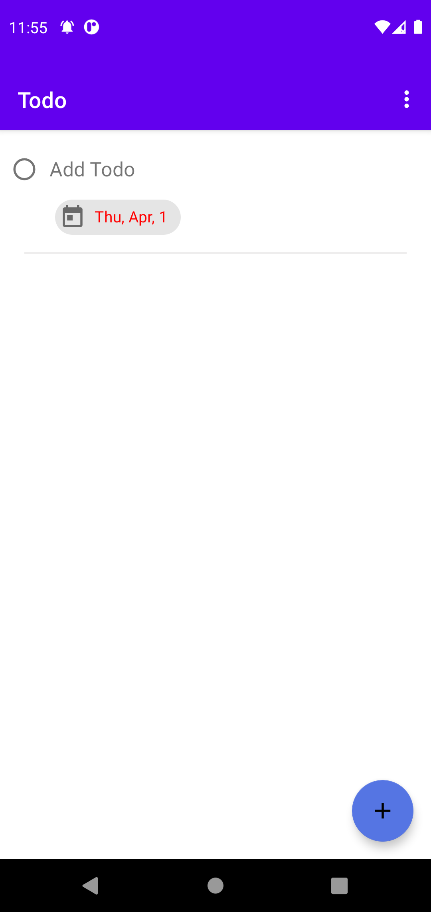
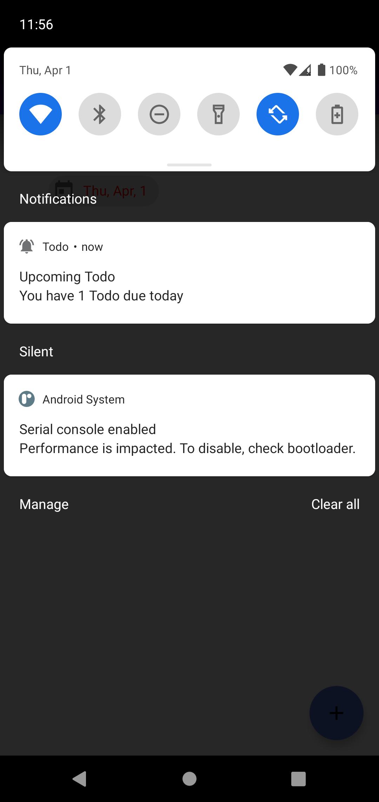
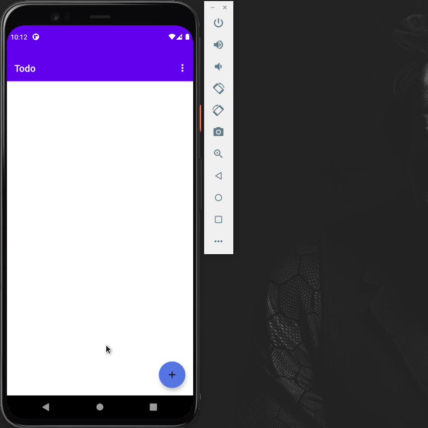

# Todo - All of your Todos in One Place

Flexibly create and track your daily Todo tasks, so you stay in control and achieve your goals.

## Todo architecture overview

The following diagram shows all the pieces of the app. Each of the enclosing boxes (except for the SQLite database) represents a class that is created to build the app.
## 

## App screenshots

## 
## 
## 
## 

## App running GIF
## 